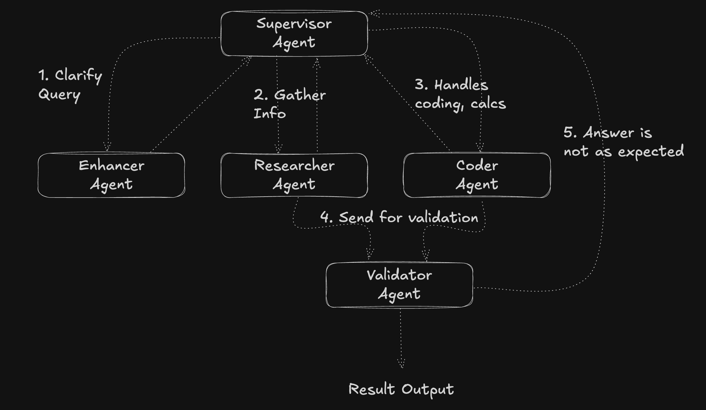

# Supervisor Agent App

A multi-agent orchestration system built with LangGraph and Flask that routes tasks between specialized AI agents to provide comprehensive responses to user queries.

## Architecture Overview

This application implements a state-based workflow using LangGraph's directed graph architecture with specialized AI agents that work together to process user queries.

## Workflow Process

1. User submits a query through the API
2. The Supervisor agent evaluates the query and routes it to the appropriate specialist
3. Specialized agents (Enhancer, Researcher, or Coder) process the query
4. The Validator checks if the response adequately answers the query
5. If inadequate, the workflow returns to the Supervisor for re-routing
6. If adequate, the final response is returned to the user

## Components

### Agents

- **Supervisor**: Routes tasks to specialized agents based on query analysis
- **Enhancer**: Clarifies vague or incomplete user queries
- **Researcher**: Gathers information using search tools (DuckDuckGo)
- **Coder**: Handles technical problems, calculations, and code execution
- **Validator**: Verifies if the response adequately addresses the user's query

### Technologies

- **LangGraph**: For orchestrating the agent workflow
- **LangChain**: For agent creation and tool integration
- **Flask**: Backend API server
- **Groq**: LLM provider (llama-3.3-70b-versatile model)
- **React**: Frontend interface (in the frontend directory)

## Implementation Details

### State Management

The application uses LangGraph's `StateGraph` to maintain conversation state and route between agents. Each agent receives the current state, processes it, and returns a command that includes:

1. State updates (new messages)
2. The next node to route to

### Agent Selection Logic

The Supervisor agent uses a structured output model to decide which specialist to route to:

- **Enhancer**: For unclear queries that need refinement
- **Researcher**: For information-gathering tasks
- **Coder**: For technical problems, calculations, and code execution

### Validation Process

The Validator examines both:

- The original user query
- The specialist's response

It then decides to either:

- End the workflow if the response is satisfactory
- Route back to the Supervisor if further processing is needed

## API Endpoints

- **GET /** - Simple health check
- **POST /api/chat** - Submit a user query
  - Input: JSON with `{"input": "user question"}`
  - Output: JSON with answer and detailed processing information